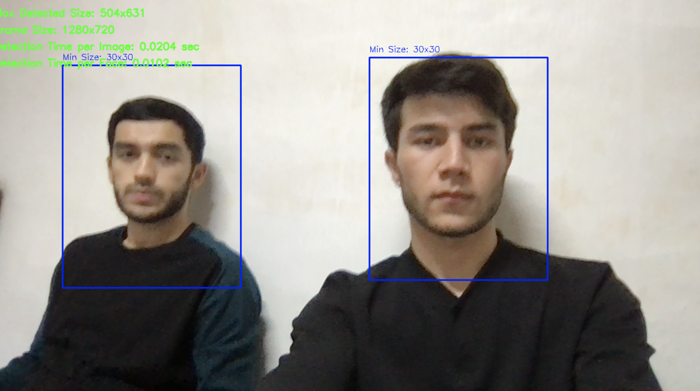
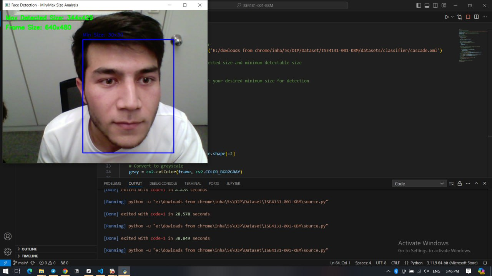

# 📄 Project Report: Face Detection using Viola-Jones (VJ) Algorithm

## 1. Introduction
This project aims to implement and evaluate a real-time face detection system using the Viola-Jones (VJ) algorithm. The project is developed as part of the **Digital Image Processing Design** course at **Inha University**. Our objective is to create an efficient face detector using OpenCV and Haar features.

---

## 2. Project Details
- **University**: Inha University
- **Department**: SGCS
- **Major**: Integrated System Engineering (ISE)
- **Course**: Digital Image Processing Design `[202402-ISE4131-001]`
- **Professor**: Kakani Vijay
- **Project Title**: Face Detection using Viola-Jones (VJ) Algorithm
- **Team**: KBM

### Team Members
- **Team Lead**: Shukrullo Meliboev  
  - Student ID: `12225261`
- **Team Member**: Arsen Baktybek uulu  
  - Student ID: `12225262`
- **Team Member**: Asadbek Kiyomov  
  - Student ID: `12225264`

---

## 3. Objectives
- To practice programming the VJ algorithm using OpenCV.
- To utilize Haar features to accurately detect faces.
- To evaluate the performance of the face detector by analyzing maximum and minimum detectable face sizes, as well as detection speed.

---

## 4. Methodology

### 4.1 Training
- **Cascade Classifier**: The face detection model is trained using a combination of public datasets and a self-made dataset that includes images of team members under various orientations, scales, and lighting conditions.
- **Data and Resources**:
  - [Training Data Link](https://drive.google.com/drive/folders/1eKAg2KUzV6aSoDvpSEWK06y1WKEOHQiC?usp=sharing) - Contains datasets used for training and testing.

### 4.2 Testing and Evaluation
- **Image Size**: 1024 x 768 pixels.
- **Evaluation Metrics**:
  - Minimum detectable face size.
  - Maximum detectable face size.
  - Average detection time per image and per face.

---

## 5. Results

### Minimum and Maximum Detectable Face Sizes
The face detection script (`source.py`) was run, and the results for minimum and maximum detectable face sizes were captured in real-time. The detected sizes are as follows:

- **Minimum Detectable Size**: 30 x 30 pixels
- **Maximum Detected Size**:
  - Example 1: 283 x 353 pixels
  - Example 2: 344 x 429 pixels

#### Captured Images

*Max Detected Size: 283x353 pixels*

*Min Detected Size: 344x429 pixels*

### Average Detection Time
- **Per Image**: 0.0213 seconds
- **Per Image Per Face**: 0.01 seconds

---

## 6. Discussion
### Observations
- **Performance Analysis**:
  - The VJ algorithm is capable of detecting faces in real-time with a reasonable level of accuracy for different face sizes.
  - The results indicate that the face detector can successfully detect faces within a range of sizes, with the smallest detectable size being 30 x 30 pixels.
  
### Challenges and Limitations
- The accuracy of detection may vary depending on the presence of factors like:
  - Viewpoint variation
  - Deformation
  - Occlusion
  - Illumination changes
  - Cluttered or textured backgrounds
  - Intra-class variation

Further analysis will be conducted to evaluate the detector’s performance under these conditions.

---

## 7. Future Work
- **Performance Optimization**: Test the model under different lighting and orientation conditions to optimize its accuracy.
- **Additional Evaluations**: Determine the average detection time per image and per face to assess real-time efficiency.
- **Complete Documentation**: Update this report with a thorough analysis of detection challenges.

---

## 8. Project Demonstration
- **Demo Video**: A demonstration video showcasing the face detection process and results is available here:
  - [Video Link](https://drive.google.com/file/d/1uPG95scLV3zaYdYxJ_S2bBMrVD29NFVn/view?usp=drive_link)

---

## 9. References
- OpenCV Documentation
- Viola, P., & Jones, M. (2001). Rapid Object Detection using a Boosted Cascade of Simple Features. Proceedings of the 2001 IEEE Computer Society Conference on Computer Vision and Pattern Recognition.
